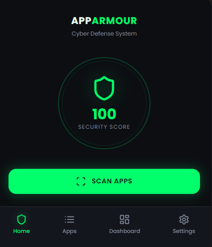
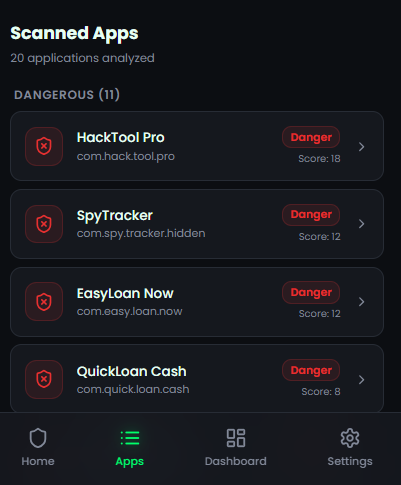
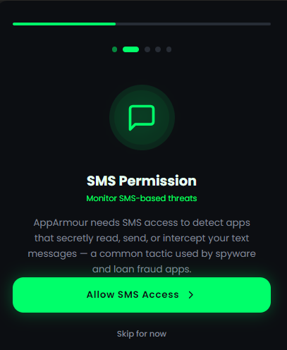
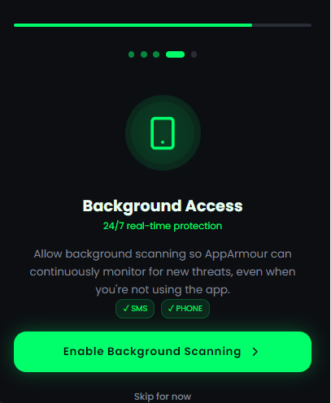
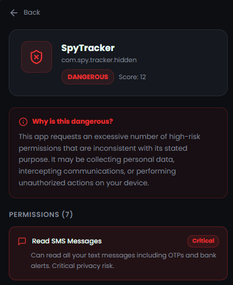
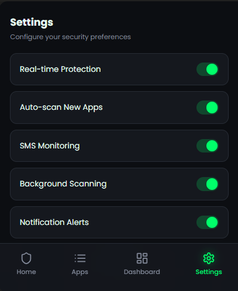

# 🛡️ AppArmour – Real-Time Malware & Fake App Detection System

AppArmour is a prototype Android security application designed to detect malicious and fake applications based on permissions and behavioral patterns. It focuses on preventing financial fraud caused by fake banking apps distributed via SMS, WhatsApp, and third-party APK downloads.

---

## 🎯 Problem Statement

Fake and malicious apps are widely circulated through messaging platforms like WhatsApp and SMS. These apps mimic trusted platforms (e.g., banking apps) and steal sensitive information such as OTPs, login credentials, and financial data.

---

## 💡 Proposed Solution

AppArmour provides a lightweight background security mechanism that scans installed applications and evaluates their risk using a rule-based detection engine.

It alerts users in real time and helps them take action before any damage occurs.

---

## 🚀 Key Features

- 🔍 Scan installed applications  
- 🧠 Permission-based risk analysis  
- 🚨 Real-time risk classification:
  - 🟢 Safe  
  - 🟡 Suspicious  
  - 🔴 Dangerous  
- 🧹 One-click uninstall suggestion  
- ⚡ Lightweight and fast  

---

## 🏗️ System Architecture
User Action
↓
Detection Layer
↓
APK / App Scanner
↓
Risk Analysis Engine
↓
Decision Module
↓
Alert System
↓
User Action (Uninstall / Ignore)

---

## 🔄 Working Flow

1. User clicks **Scan Apps**  
2. App retrieves installed applications  
3. RiskAnalyzer evaluates permissions  
4. Risk score is generated  
5. App displays risk level  
6. User can uninstall dangerous apps  

---

## ⚙️ Tech Stack

- 📱 Android (Java)  
- 🔍 PackageManager API  
- 🎨 XML Layouts  
- ⚡ Rule-based Detection System  

---
## 📸 Screenshots

### 🏠 Home Screen

### 🔍 Scan Screen

### ⚠️ Permission Alert

### 🔐 Access Screen

### 🧠 Detection Screen

### ⚙️ Settings Screen

## 🧠 Methodology

- Permission-based malware detection  
- Pattern recognition (keywords like *bank*, *loan*)  
- Risk scoring system  
- Real-time alert mechanism  

---

## 📂 Project Structure
app/
└── src/
└── main/
├── java/com/apparmour/
│ ├── MainActivity.java
│ ├── ScannerActivity.java
│ └── RiskAnalyzer.java
│
├── res/layout/
│ ├── activity_main.xml
│ └── activity_scanner.xml
│
└── AndroidManifest.xml

---

## ⚠️ Limitations

- Cannot automatically delete apps due to Android security restrictions  
- Cannot monitor encrypted messaging apps (privacy limitations)  
- Uses rule-based detection (AI integration planned)  

---

## 🌍 Impact

- Helps prevent digital fraud  
- Protects non-technical users  
- Increases awareness about fake apps  

---

## 🚀 Future Scope

- 🤖 AI/ML-based malware detection  
- 🏦 Integration with banking systems (e.g., SBI)  
- 🌐 Real-time threat intelligence system  
- 🔊 Voice alerts for accessibility  

---

## 🧪 Prototype Status

This is a **functional prototype** demonstrating:
- App scanning  
- Risk detection logic  
- User alert system  

---

## 👨‍💻 Author

**Dinesh Chaudhary**  
Hackathon Project – AppArmour  

---

## 📜 License

This project is for educational and hackathon purposes only.
